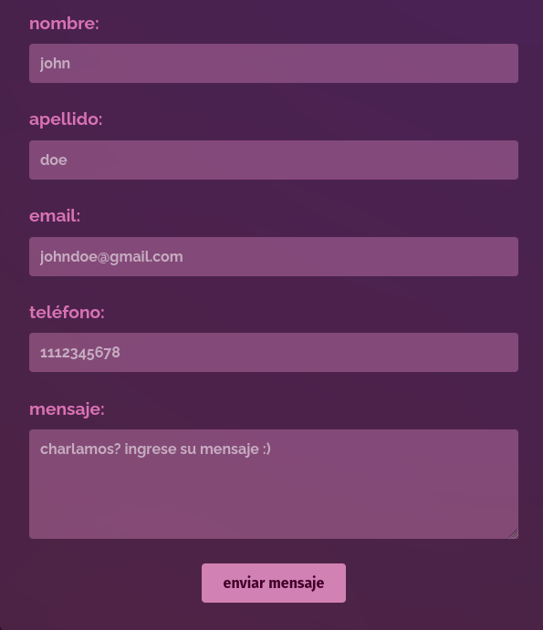

# 📌 Mi Portafolio Personal 

En este repositorio encontrarás mi portafolio realizado con HTML, CSS y JavaScript para la Segunda Práctica Formativa de la materia Desarrollo de Sistemas Web, en el marco de estudio de la Tecnicatura Superior en Desarrollo de Software. 💻 

## Nuevas implementaciones
#### 1. Validación de Formulario
Se incorporó la verificación con JavaScript de los distintos campos antes del envío del formulario mediante el uso de expresiones regulares para asegurar que los datos ingresados sean coherentes. 

#### 2. Popup de confirmación de envío
Se muestra un popup modal dando aviso al usuario que el formulario fue enviado correctamente, mejorando su experiencia con la página web. 

#### 3. Creación de contenido dinámico
Se creó un array con objetos que representan las películas y se lo recorrió con un bucle forEach para generar dinámicamente HTML en el DOM. Este permite la reutilización del código sin escribir manualmente cada elemento HTML. 

#### 4. Temporizador
Se utilizó JavaScript para calcular la diferencia entre la fecha actual y la fecha objetivo para mantener al usuario informado de cuánto es el tiempo restante para la próxima entrega.

#### 5. Contador de visitas
El contador de visitas utiliza localStorage para guardar y actualizar su número cada vez que se carga el sitio en el navegador.

## Cambios
Se incorporó el favicon y comentarios más explicativos a cada funcionalidad tratada en JavaScript como en CSS y HTML.
También, se agregaron placeholders en los campos del formulario para mostrar qué tipo de información se espera. Este cambio mejora la usabilidad del formato al guiar al usuario de forma visual al mismo tiempo que reduce errores de ingreso.

